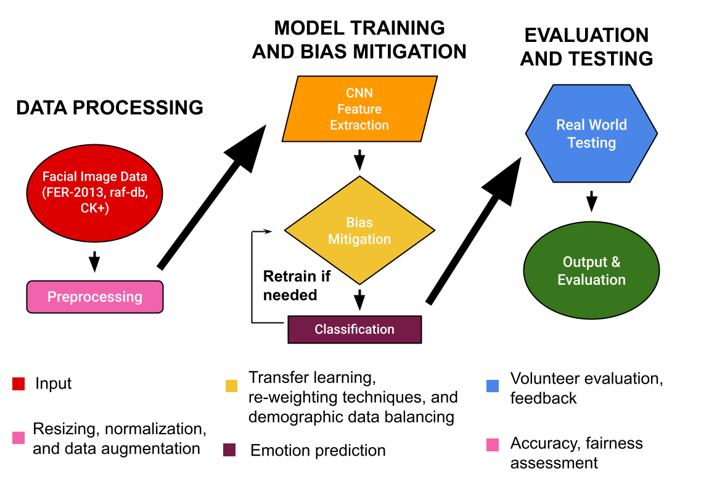
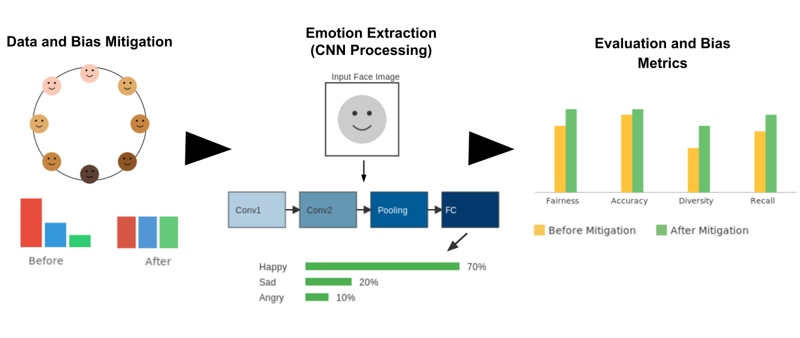

# Fairness-Aware Facial Emotion Recognition


## Table of Contents
- [Project Overview](#project-overview)
- [Architecture](#architecture)
- [Data](#data)
  - [Raw Data](#raw-data)
  - [Preprocessed Data](#preprocessed-data)
- [Dependencies & Setup](#dependencies--setup)
- [Usage](#usage)
  - [Attribute Inference Script](#attribute-inference-script)
  - [Notebooks](#notebooks)
- [Outputs](#outputs)
- [Contributing](#contributing)

## Project Overview
This repository provides code and resources for studying fairness in facial emotion recognition.
We preprocess popular datasets (CK+, FER2013, RAF-DB), infer demographic attributes (age, gender, race)
using DeepFace, train baseline and debiased models, and evaluate model performance across demographic groups.

## Architecture


- **Data Preprocessing**: Standardize face images and convert to NumPy arrays by emotion class.
- **Attribute Inference**: Extract age, gender, and race using DeepFace.
- **Model Training**: Train baseline CNN and ResNet50 models.
- **Bias Mitigation**: Apply reweighting and adversarial debiasing techniques.
- **Evaluation**: Produce confusion matrices and classification reports across demographic groups.

## Data
### Raw Data
Download and place the following datasets under `data/`:
- CK+ (facial expressions)
- FER2013 (Kaggle competition)
- RAF-DB (facial emotion dataset)

### Preprocessed Data
Preprocessed NumPy arrays are provided under `data_preprocessed/`, organized by dataset and emotion class:
```
data_preprocessed/
├── ck+/
├── fer2013/
└── raf-db/
```
Each dataset folder contains subfolders for emotion labels:
`angry`, `disgust`, `fear`, `happy`, `neutral`, `sad`, `surprise`.

To regenerate preprocessing, run:
```
notebooks/01_preprocessing.ipynb
```

## Dependencies & Setup
- Python >= 3.7
- deepface
- tensorflow
- numpy
- pandas
- scikit-learn
- seaborn
- matplotlib
- opencv-python
- jupyter

Install dependencies:
```bash
pip install deepface tensorflow numpy pandas scikit-learn seaborn matplotlib opencv-python jupyter
```

Clone the repository:
```bash
git clone <repo-url>
cd <repo-directory>
```

## Usage
### Attribute Inference Script
The `scripts/infer_attributes.py` script scans images, detects faces, and predicts demographic attributes in parallel:
```bash
python scripts/infer_attributes.py \
  --input_dir data_preprocessed/fer2013 \
  --output_csv image_attributes_summary.csv \
  --log_file infer_attributes.log \
  --max_workers 4
```

### Notebooks
- **01_preprocessing.ipynb**: Face detection, cropping, and dataset preparation.
- **02_demographics_inference.ipynb**: Infer age, gender, and race attributes.
- **03_baseline_model_training.ipynb**: Train baseline CNN and ResNet50 models.
- **04_resnet50_finetune.pdf**: Summary of ResNet50 fine-tuning process.
- **05_bias_mitigation_reweighting.ipynb**: Apply reweighting bias mitigation.
- **06_adversarial_debiasing.ipynb**: Apply adversarial debiasing techniques.

Run the notebooks sequentially to reproduce the analysis pipeline.

## Outputs
- **outputs/ClassificationMatrix/**: Confusion matrix images by model and demographic group.
- **outputs/ClassificationReports/**: Classification reports (precision, recall, F1-score).

## Contributing
Contributions and feedback are welcome! Please open issues or pull requests to suggest improvements or report issues.

---
*This README provides an overview and instructions for the Facial Emotion Recognition Fairness project.*
